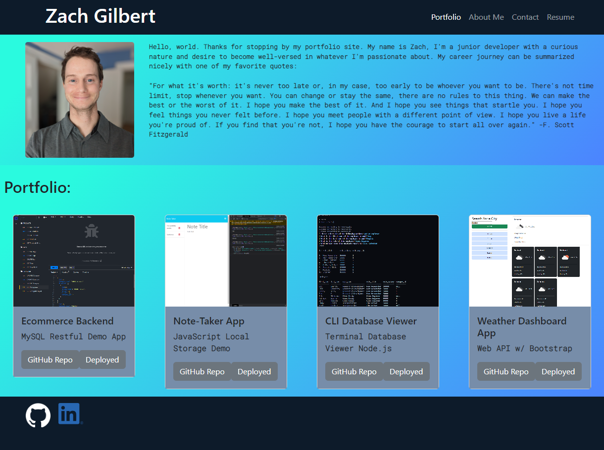

# React Portfolio

## Description

The driving force behind this (ongoing) project portfolio is to try to follow that "best-foot-forward" mentality by creating a single-page React app that highlights my various JavaScript projects.
I built this project to provide additional material for potential job recruiters and/or clients in the form of completed/ongoing personal coding projects in JavaScript.
Hopefully this page will provide additional clarity in my abilities, and my desire to improve on previously-completed projects.
I learned a great deal of React by working on this portfolio. A project like this is a great starting point in the world of React because it doesn't require a whole lot of experience to build the components and stateful variables for the portfolio. It was fun though!

## Table of Contents

### [Installation](#installation)

### [Usage](#usage)

### [Screenshots](#screenshots)

### [Contributions](#contributions)

### [Tests](#tests)

### [Questions](#questions)

### [License](#license)

## Installation

To install using the terminal: npx create-react-app ., then `npm install` to install the required npm package library.

## Usage

The user may navigate through my Portfolio, contact me via the Contact nav link, and view my resume by clicking on the Resume nav link.

## Screenshots

## Contributions

No outside collaborators were involved on this project.

The third-party assets used on this project include Node.js, React-Bootstrap for styling, and the React dev platform itself.
Much of the styling for this portfolio was created using React-Bootstrap and therefore I owe a lot to the Bootstrap docs for providing a guiding light through the CSS world.

## Tests

User testing for functionality was used on this project, as well as utilization of a linter during the build process.

## Questions

Please direct any further questions to: buster35 or gilb9711@gmail.com.

## License

The license used for this project is MIT: https://choosealicense.com/licenses/mit/#.
